# Hi, I'm Aastha Garg 👋

**Technical Program Manager · Data & Analytics · Seattle, WA**

I build tools and systems that bridge the gap between complex business needs and technical delivery. 8+ years owning end-to-end programs across data platforms, BI reporting, and AI-powered products — from intake and requirements through launch, adoption, and ongoing stakeholder support.

Currently exploring TPM roles in analytics and data products.

---

## What I work with

---

## How I think about building

```mermaid
flowchart LR
    A[Stakeholder Request] -->|AI Requirements Assistant| B[Structured PRD]
    B -->|ADO Toolkit| C[Prioritized Backlog]
    C -->|Engineering Delivery| D[Data Product]
    D -->|Retail Dashboard| E[Self-Serve Insights]
    E -->|Superset Starter Kit| F[Team Adoption]
    F -->|Feedback loop| A
    
    style A fill:#E1F5EE,stroke:#0F6E56,color:#0F6E56
    style B fill:#E1F5EE,stroke:#0F6E56,color:#0F6E56
    style C fill:#E1F5EE,stroke:#0F6E56,color:#0F6E56
    style D fill:#E1F5EE,stroke:#0F6E56,color:#0F6E56
    style E fill:#E1F5EE,stroke:#0F6E56,color:#0F6E56
    style F fill:#E1F5EE,stroke:#0F6E56,color:#0F6E56
```

---

## Projects

### 🛒 [Retail Analytics Dashboard](https://github.com/aastha1513/retail-analytics-dashboard)
Interactive self-serve analytics platform built on synthetic CPG retail data. Streamlit + DuckDB + Plotly — mirrors the insights platform I built at PDI. Includes a reusable SQL views library and data freshness monitoring.

`Python` `Streamlit` `DuckDB` `SQL` `Plotly`

---

### 🤖 [AI Requirements Assistant](https://github.com/aastha1513/ai-requirements-assistant)
Paste a raw stakeholder request → get a structured PRD in seconds. Uses Claude API to extract user stories, acceptance criteria, dependencies, risks, and open questions. Directly demonstrates the core TPM skill: translating ambiguous asks into actionable specs.

`Python` `Claude API` `Streamlit` `Prompt Engineering`

---

### 📋 [TPM ADO Toolkit](https://github.com/aastha1513/tpm-ado-toolkit)
Reusable Azure DevOps templates (epics, features, user stories) + a Python prioritization engine that scores backlog items by impact × urgency × effort and outputs a color-coded Excel report. Built from how I managed 3 engineering squads across 8 quarterly releases.

`Python` `Azure DevOps API` `pandas` `openpyxl` `YAML`

---

### 📊 [Superset TPM Starter Kit](https://github.com/aastha1513/superset-tpm-starter-kit)
The internal Superset + Claude Code documentation I built at PDI — made public. SQL snippet library, reusable chart configs, step-by-step guides, and a unique guide on using Claude Code to accelerate self-serve BI. Importable sample dashboard included.

`Apache Superset` `SQL` `Claude Code` `DuckDB` `Markdown`

---

## By the numbers

| | |
|---|---|
| **$2M+ ARR** | Scaled Retailer Insights SaaS at PDI Technologies |
| **400+ users** | Onboarded across 40+ enterprise CPG customers |
| **95% on-time delivery** | Across 8 quarterly releases, 3 engineering squads |
| **120+ hrs/month saved** | Via AI-powered product mapping automation |
| **87% → 99.2%** | Data accuracy improvement, reducing churn by 15% |

---

## Currently reading / thinking about

- How agentic AI changes the TPM role (less coordination overhead, more strategy)
- Data mesh vs centralized BI — what actually works at mid-market scale
- Making Power BI and Superset play nicely in the same org

---

## Let's connect

---

Open to TPM roles in analytics, data products, and AI-powered platforms · Seattle, WA · Open to remote
